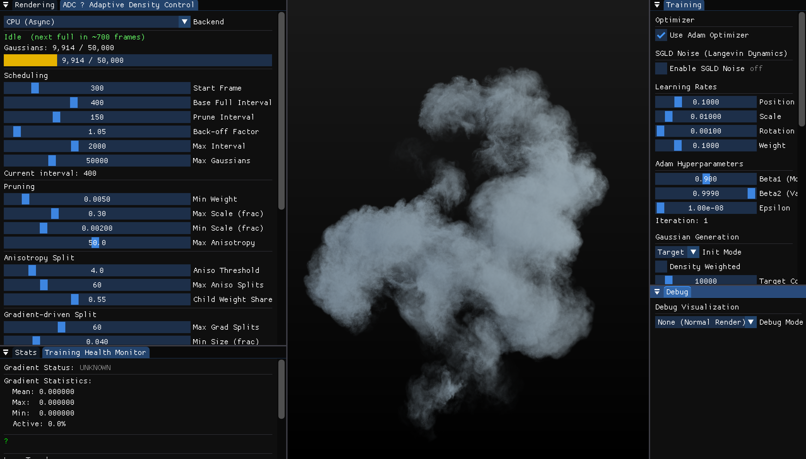
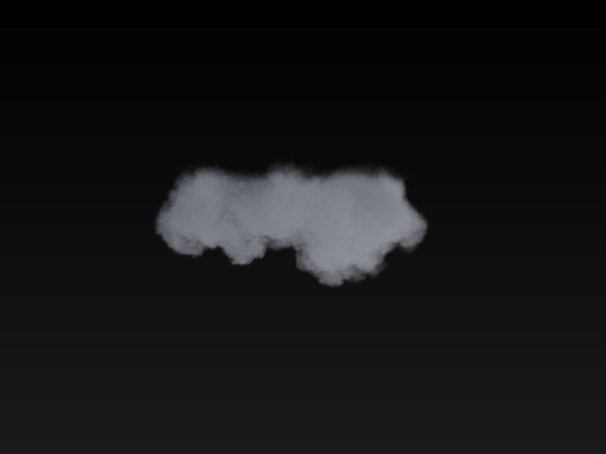
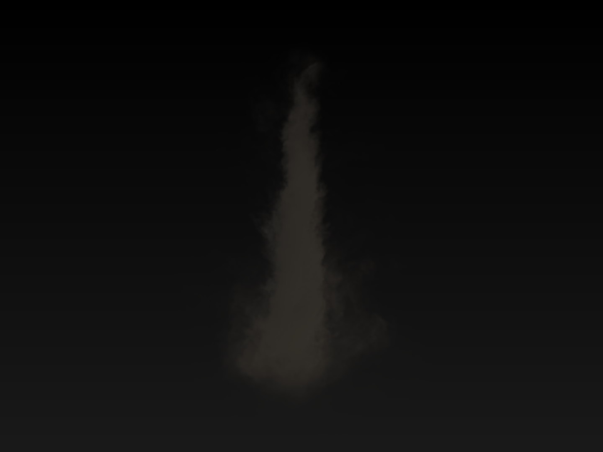
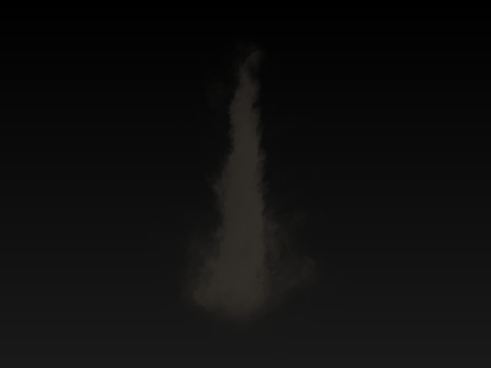
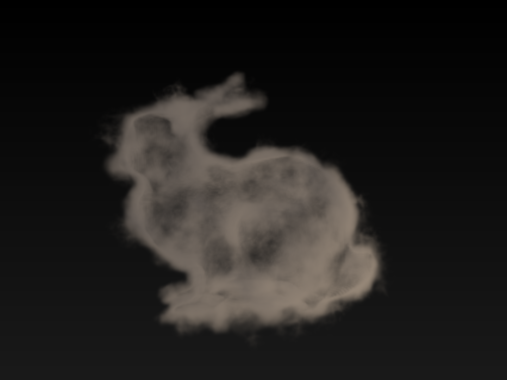
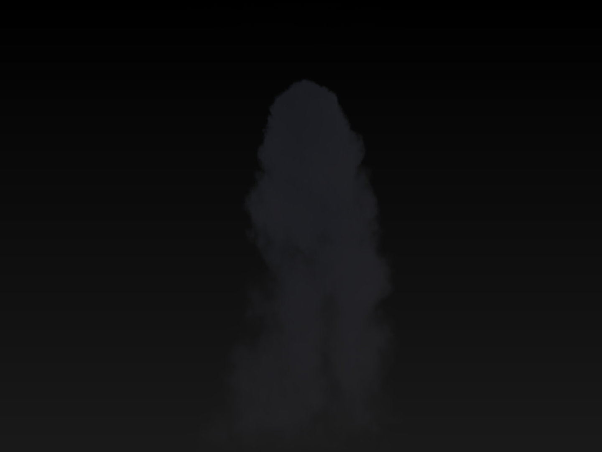
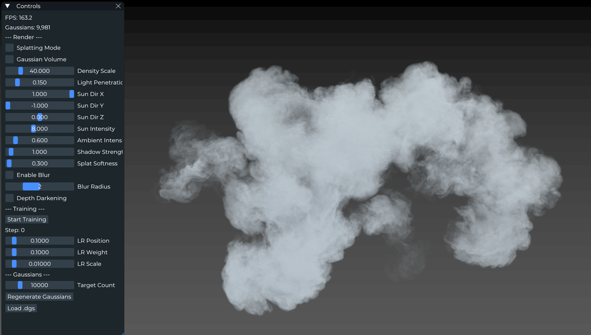
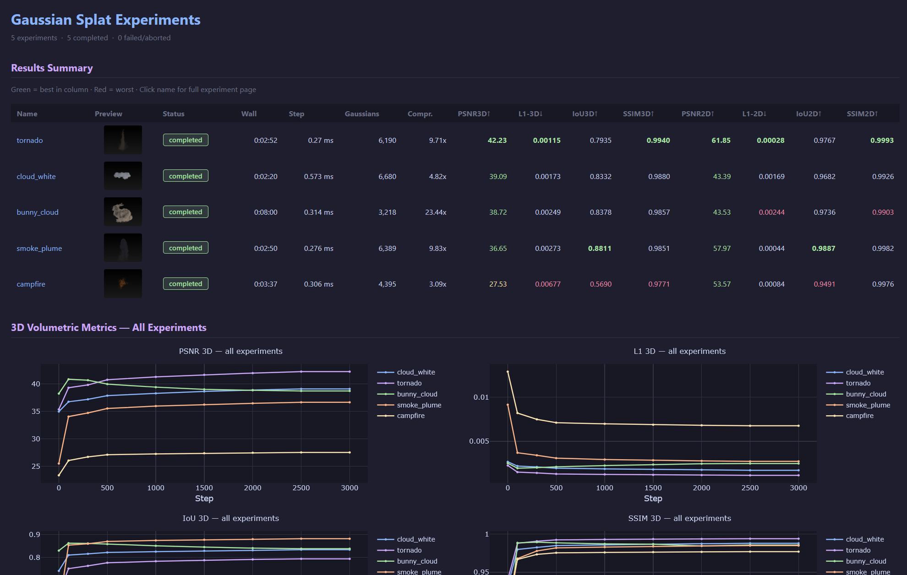

# VDBaussian

GPU-accelerated fitting of 3D Gaussians to OpenVDB volumetric data — smoke, clouds, tornadoes, fire, and arbitrary VDB density grids. Training runs entirely on the GPU through Slang compute shaders dispatched via [slangpy](https://shader-slang.com/slang/) on Vulkan; the CPU only handles config, adaptive density control, and the UI.

The result is a compact set of anisotropic 3D Gaussians that approximates a VDB volume and can be rendered in real time, either directly via a 2D screen-space splatting pipeline or by accumulating them back into a 3D density volume with the included **Gaussian-to-volume rasterizer**.

<p align="center">
  
</p>

## Examples

Reference (raymarched ground-truth VDB) on the left, fitted Gaussian reconstruction on the right. All examples below use ~50k Gaussians, 3000 training steps, 196³ working resolution.

### Cloud

<table width="100%">
  <tr>
    <td width="50%" align="center"><b>Reference</b></td>
    <td width="50%" align="center"><b>Reconstruction</b></td>
  </tr>
  <tr>
    <td width="50%"></td>
    <td width="50%"></td>
  </tr>
</table>

### Tornado

<table width="100%">
  <tr>
    <td width="50%" align="center"><b>Reference</b></td>
    <td width="50%" align="center"><b>Reconstruction</b></td>
  </tr>
  <tr>
    <td width="50%"></td>
    <td width="50%"></td>
  </tr>
</table>

### Stanford Bunny (volumetric)

<table width="100%">
  <tr>
    <td width="50%" align="center"><b>Reference</b></td>
    <td width="50%" align="center"><b>Reconstruction</b></td>
  </tr>
  <tr>
    <td width="50%"></td>
    <td width="50%"></td>
  </tr>
</table>

### Smoke plume

<table width="100%">
  <tr>
    <td width="50%" align="center"><b>Reference</b></td>
    <td width="50%" align="center"><b>Reconstruction</b></td>
  </tr>
  <tr>
    <td width="50%"></td>
    <td width="50%"></td>
  </tr>
</table>

## What It Does

Each Gaussian is parameterised by 11 floats: position (3) + scale (3) + rotation quaternion (4) + weight (1). Training minimises a per-voxel reconstruction loss between the rasterised Gaussian volume and the source VDB grid sampled into a dense cube.

The pipeline supports:

- **Multiple loss functions** — L2 / L1 (pseudo-Huber) / Huber, optionally blended with 3D D-SSIM.
- **Two optimisers** — Adam (default) and SGD, with optional SGLD (Langevin) noise injection.
- **Per-parameter learning rates** for position, scale, rotation, and weight, with declarative LR schedules patched in at given training steps.
- **Adaptive Density Control (ADC)** — runtime pruning, splitting, and cloning of Gaussians driven by gradient magnitude, anisotropy, contribution, and density error. Adam momentum is transplanted across operations.
- **Tile-accelerated forward & backward** — Gaussians are spatially binned into 3D tiles each ADC cycle so the per-voxel pass only evaluates Gaussians that overlap that tile.
- **3D Gaussian-to-volume rasterizer** — accumulates Gaussians into a dense density texture for both training (used by SSIM and the per-voxel loss) and inspection. Implemented in [shaders/3drasterizer.slang](shaders/3drasterizer.slang).
- **2D screen-space splatting renderer** — projects Gaussians, depth-sorts via on-GPU bitonic sort, bins into screen tiles, and front-to-back composites with analytic per-Gaussian self-shadowing. Implemented in [shaders/splatting.slang](shaders/splatting.slang).
- **Two metric tiers** — 3D volumetric (PSNR, L1, IoU, per-axis SSIM slices) and 2D screen-space (raymarched reference vs. raymarched reconstruction from canonical cameras).

### Optional features

- **PLY export** — final Gaussians can be written out in standard `.ply` form for use in tools like [SuperSplat](https://playcanvas.com/supersplat). Toggle via `output.save_ply_at_end` in the config; lighting bake parameters live next to it.

## Installation

Requires a Vulkan-capable GPU and Python 3.10+.

```bash
pip install -r requirements.txt
```

`requirements.txt` covers slangpy, ImGui, GLFW, PyOpenGL, and matplotlib. **OpenVDB Python bindings must be installed by hand** — they are not on PyPI in a portable form. Prebuilt wheels matching the supported Python versions live in this Google Drive folder:

> https://drive.google.com/drive/folders/13RA4emqmg9DavpYzXmJ2zYjES7eqLcZU?usp=sharing

Pick the wheel that matches your Python version and install with `pip install path/to/openvdb-*.whl`.

A pair of sample VDB files (`cloud_01_variant_0000.vdb`, `cloud_04_variant_0000.vdb`) is included so you can run the project without sourcing your own data.

### Pre-computed results archive

The same Google Drive folder also hosts `results.zip` — the full set of results from every experiment in [config/](config/), including snapshot renders, metrics, and the auto-generated HTML reports. It is too large to ship in the repo (~16 GB), so download it from the link above if you want to browse the experiments without re-running them.

## Running

There are four ways to run, depending on what you want to do.

### 1. Interactive GUI (full ImGui mode)

```bash
python app.py
```

Opens an ImGui + OpenGL window with a live raymarched view of the source VDB next to the fitted Gaussians. Sliders cover loss mode, learning rates, ADC parameters, lighting, and so on. Best for poking at a single VDB, watching training converge, and tuning hyperparameters interactively.

<p align="center">
  
</p>

### 2. Stripped UI mode (slangpy-native window)

Set `EXTENDED_UI = False` at the top of [app.py](app.py) and run the same command:

```bash
python app.py
```

This falls back to a minimal slangpy-native window with no ImGui dependency — just the live render. Startup is faster and per-frame overhead is lower, which makes it the most convenient mode for **iterating on the rasterizer or splatting shaders** without the rest of the UI getting in the way.

<p align="center">
  
</p>

### 3. Single headless run

```bash
python train_headless.py --config config/example_batch.yaml --experiment baseline_adam_l2
```

Runs one experiment to completion with no GUI, writes metrics and snapshot renders to `results/<experiment_name>/`. Exit codes:

- `0` — success
- `2` — gradient explosion detected (when configured to abort)
- `3` — NaN encountered
- `99` — uncaught exception

### 4. Batch experiments

```bash
python experiment_runner.py config/example_batch.yaml
```

Spawns one subprocess per experiment listed in the batch YAML, applies global overrides on top of `config/defaults.yaml`, then deep-merges each experiment's per-run overrides. At the end [report_generator.py](report_generator.py) builds an HTML comparison report so you can browse all runs side-by-side.

<p align="center">
  
</p>

## Configuration

[config/defaults.yaml](config/defaults.yaml) is the master config; every tuneable parameter has a sensible default there. Experiment YAMLs only need to override what they change. Top-level sections:

- `volume` — VDB file, working resolution, tile size
- `training` — loss, optimiser, per-parameter LRs, LR schedule, SSIM blend
- `sgld` — Langevin noise (optional)
- `gaussian_init` — count vs. percentage, density-weighted vs. uniform, jitter
- `adc` — pruning thresholds, split heuristics, clone budgets
- `metrics_3d` / `metrics_2d` — what to log and how often
- `rendering` — raymarcher step size, lighting, shadows
- `output` — checkpoints, snapshot cameras, optional PLY export
- `health` — divergence detection (gradient explosion / vanish / NaN)

LR scheduling is declarative — a list of `{at_step, field: value}` patches applied once when the step is reached:

```yaml
training:
  lr_schedule:
    - at_step: 1000
      learning_rate_pos: 0.03
      learning_rate_weight: 0.03
    - at_step: 2000
      use_adam: false
```

A growing collection of experiment configs lives in [config/](config/) — optimiser sweeps, LR-ratio grids, ADC ablations, capstone runs across multiple VDBs, etc.

## Repository Layout

```
app.py                  Interactive GUI + Renderer (GPU pipeline manager)
train_headless.py       Single-experiment subprocess entry point
experiment_runner.py    Batch orchestrator
adc.py                  Adaptive Density Control (CPU/NumPy)
metrics.py              3D volumetric metrics
screen_metrics.py       2D screen-space metrics
config_loader.py        YAML deep-merge + apply to runtime configs
report_generator.py     HTML report builder
save_ply.py             Optional Gaussian -> SuperSplat exporter

shaders/                Slang compute shaders
  training.slang          forward/backward, optimiser, SSIM gradient
  3drasterizer.slang      Gaussian -> volume rasterizer
  splatting.slang         2D screen-space splatting (project, sort, render)
  metrics.slang           3D volumetric metrics
  screen_metrics.slang    2D rendered-image metrics
  debug_raymarch.slang    visualisation helpers

config/                 defaults.yaml + experiment configs
tools/                  plotting & analysis helpers (matplotlib)
cloud_*.vdb             sample VDB files
```

## Hardcoded Constants

`VOL_SIZE=196`, `TILE_SIZE=4`, and `MAX_GAUSSIANS_PER_TILE=256` are defined at the top of [app.py](app.py) and **must match** the corresponding values in the Slang shaders. The headless runner patches these via constant injection before launching, so per-experiment resolution overrides work without manual edits.

## Output

Each run writes to `results/<experiment>/`:

- `config_used.yaml` — fully-merged config used for the run (reproducible)
- `results.json` — metrics history + final summary
- `final_gaussians.dgs` — custom dense binary format (faster to reload than other formats)
- `step_NNNNNN_<camera>_pred.png` / `_ref.png` — periodic snapshot renders from the configured snapshot cameras

Batch runs additionally produce a `report.html` and a `batch_summary.json` at the batch root.

## Notes

- Atomic float addition (used for gradient accumulation in [shaders/training.slang](shaders/training.slang)) is written as `InterlockedAdd` directly on a `float` buffer. Slang lowers this to a SPIR-V float-atomic op and slangpy enables the corresponding [`VK_EXT_shader_atomic_float`](https://registry.khronos.org/vulkan/specs/latest/man/html/VK_EXT_shader_atomic_float.html) device feature automatically — so there is nothing to configure on the user side, but the GPU + driver still need to expose it. Most modern discrete GPUs (NVIDIA Turing+, AMD RDNA2+, recent Intel Arc) do; on hardware that doesn't, slangpy will fail to bring up the device and a portable fallback using an `asuint`/`asfloat` CAS loop would be required.
- SSIM uses fixed `C1=0.0001`, `C2=0.0009` (assuming density in `[0, 1]`).
- ADC runs asynchronously on a daemon thread so it doesn't stall the training loop.